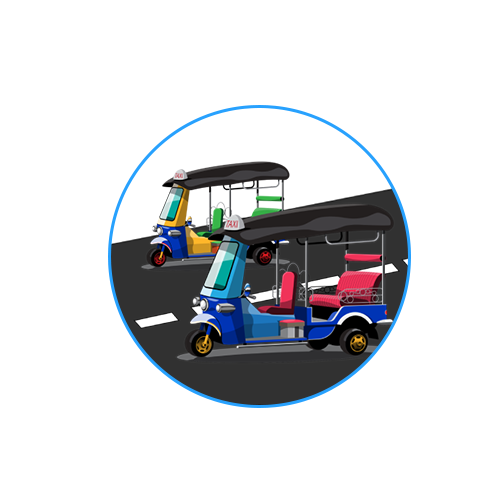
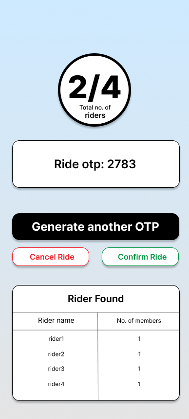
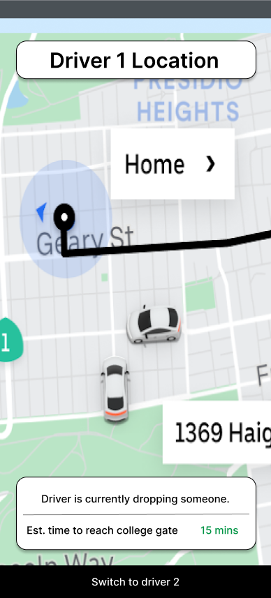
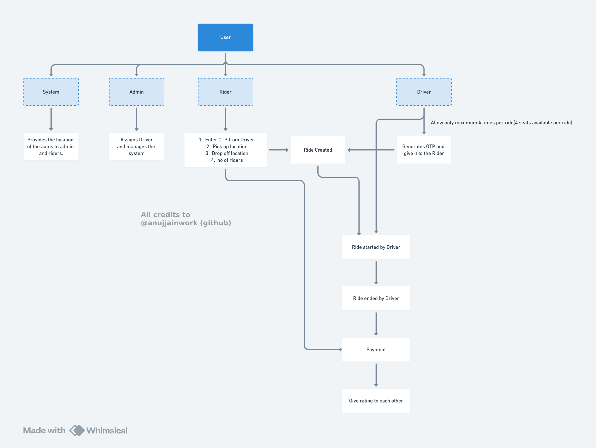

<table>
  <tr>
    <td>
      
    </td>
    <td>
      <h1><b>EzyRide - Ride availability & booking app</b></h1>
    </td>
  </tr>
</table>

---

## App Designs

  
  
  
  

---

## App Logic

> *Understanding the app flow of EzyRide*

  

---

## Features

 **1. Real-time updates** – Get real time updates where the nearest drivers are.   
 **2. Google maps** - Integrated google maps for proper navigation.   
 **3. Ride sharing** – Multiple students can share a ride.   
 **4. Emergency contact number** – Informs the emergency contact in a click.   
 **5. Driver work hours management** – Manages the shifts of the driver, helping the admin for billing.   
 **6. Payment verification** – Eliminates the UPI payment fraud.   

---

## Tech Stack

- **Flutter** – Cross-platform mobile framework.  
- **Provider (State Management)** – Manages the app logic efficiently.

---

## 🤝 Contributing

📧 For suggestions: [jainanuj.work@gmail.com](mailto:jainanuj.work@gmail.com)

---

### ⭐ If you like this project, give it a star on GitHub! ⭐
